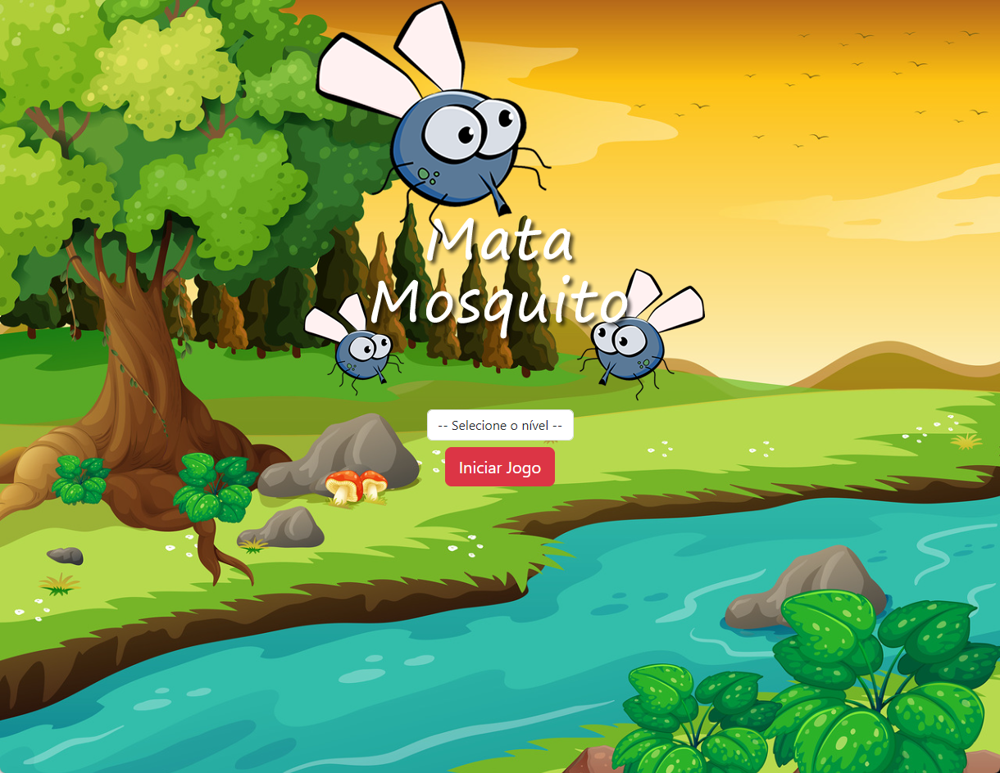

# Jogo Mata Mosquito

Curso online:

Domine Web - 20 Cursos - HTML5, CSS3, SASS, Bootstrap, JS, ES6, PHP, MySQL, JQuery, MVC, APIs, IONIC e muito mais

Autores:
Jorge Sant Ana e Jamilton Damasceno

Construção de um jogo utilizando HTML5, CSS, Bootstrap 4 e Javascript. 

>Figura 1: Mata Mosquito

 

 
 
 
